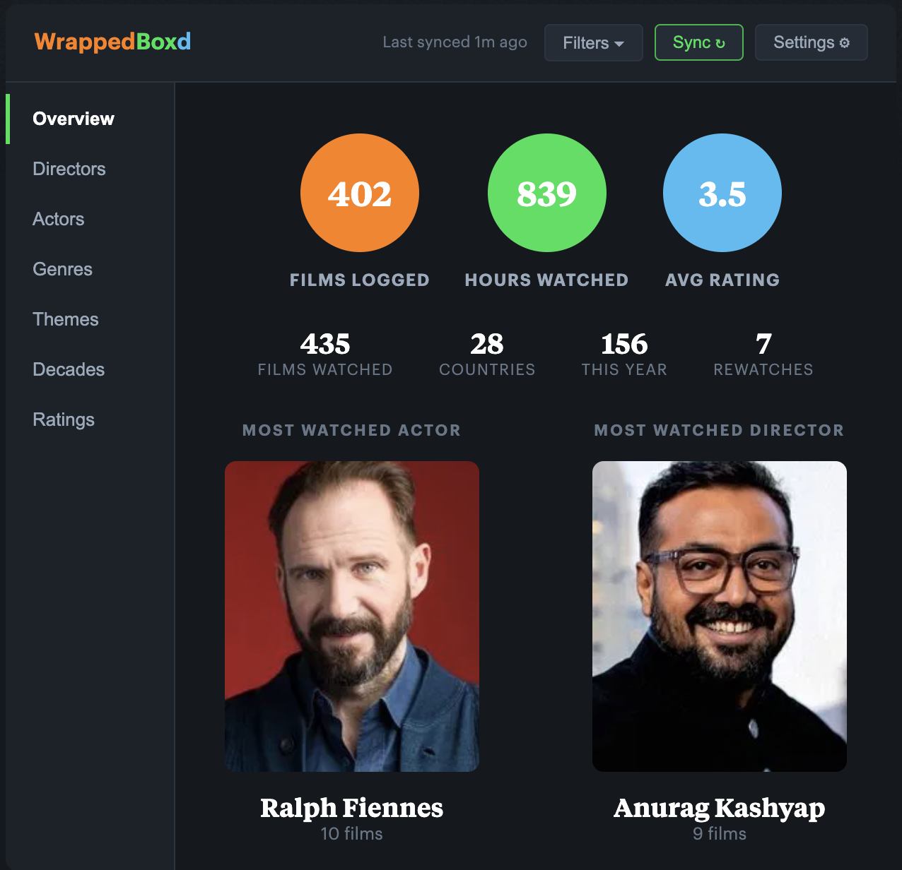
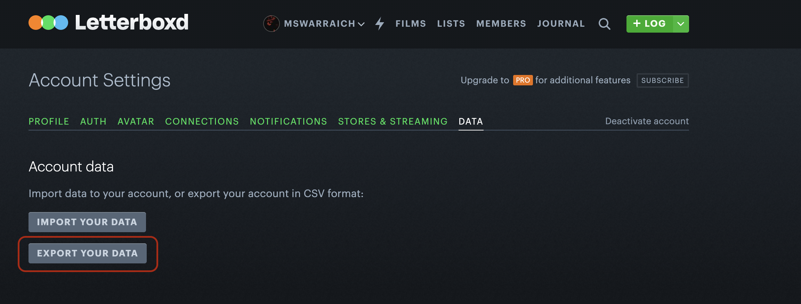
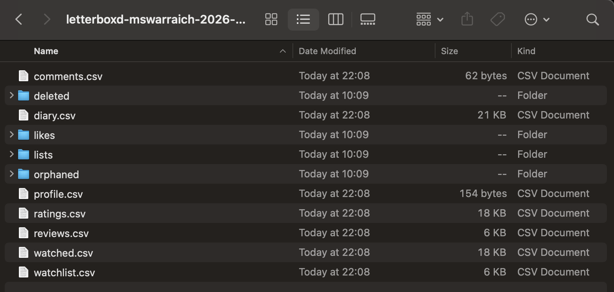

<p align="center">
  
</p>

<h1 align="center">WrappedBoxd</h1>

<p align="center">A Chrome extension that injects a rich stats panel into your Letterboxd profile page.</p>

<p align="center">
  
</p>

---

## Features

- **Overview** — Films logged, hours watched, avg rating, countries, this year
- **Directors & Actors** — Top watched with photos, film counts, avg ratings. Click any card to see all films.
- **Genres** — Doughnut chart + stacked bar chart by year
- **Decades** — Horizontal bar chart of films by decade
- **Ratings** — Histogram with avg line. Click any bar to see films with that rating.
- **Themes** — Keyword tag cloud from TMDB data
- **Filters** — Filter all sections by year watched, decade, or genre
- **Sync** — Background RSS sync on page load, manual sync button

Stats only appear on your own profile. Other profiles show lightweight stats from their public activity feed.

---

## Install

## Install

[](https://chromewebstore.google.com/detail/wrappedboxd/jlgmhfkaghicjakiifacdfkmdnjbepcd)

[](https://addons.mozilla.org/addon/wrappedboxd/)

---

## Getting your data from Letterboxd

WrappedBoxd works from your Letterboxd export files — there's no official Letterboxd API, so this is the only way to get your full history into the extension.

**Step 1 — Go to your Letterboxd settings and click Export Your Data**



**Step 2 — Download and unzip the file. You'll get these CSV files:**



The ones WrappedBoxd uses:
- `watched.csv` — every film you've marked as watched (required)
- `ratings.csv` — your star ratings
- `diary.csv` — watch dates, rewatches, and tags

**Step 3 — Visit your Letterboxd profile**

The extension will guide you through uploading these files. Once uploaded, it enriches your films with director, cast, genre, and keyword data from TMDB — no API key needed.

---

## How it stays up to date

**Your CSV is the source of truth.** Because Letterboxd doesn't have a public API, the extension can't pull your full history automatically — it reads from the files you upload.

**Sync fills in recent activity.** Every time you visit your profile, the extension quietly syncs your RSS feed to pick up new entries. But RSS only includes films you've actively *logged* (i.e. written a diary entry for). If you marked something as watched without logging it, it won't appear through sync.

**When to re-upload your CSV:**
- You want to include films you watched but didn't log
- You've accumulated a lot of new watches and want everything current
- You noticed your stats seem out of date

To re-upload: click the **Upload CSV** button in the panel header and import your latest export files.

---

## Development

**Requirements:** Node.js 18+, Chrome

```bash
git clone https://github.com/USERNAME/wrappedboxd.git
cd wrappedboxd
npm install
npm run dev    # builds to dist/ on every save
```

Load the extension: `chrome://extensions` → Enable Developer mode → Load unpacked → select `dist/`

After any code change, click the refresh icon on the extension card in `chrome://extensions`, then reload your Letterboxd tab.

```bash
npm run build  # production build
npm test       # run tests (Vitest)
```

See [CONTRIBUTING.md](CONTRIBUTING.md) for full contribution guidelines.

---

## Built with Claude Code

This project was built entirely using [Claude Code](https://claude.ai/code) (Anthropic's AI coding assistant). The `.claude/` directory in the repo contains the full context used during development:

- `.claude/CLAUDE.md` — the product spec and architecture doc that guided the build (data schema, component structure, behaviour rules)
- `.claude/commands/` — custom slash commands for reviewing PRs, addressing review feedback, and picking up GitHub issues

If you're curious about AI-assisted development or want to extend the project using the same setup, that's a good place to start.

---

## Tech stack

- Vite + vite-plugin-web-extension
- Vanilla JS (ES modules)
- Chart.js 4
- IndexedDB (local film cache)
- Manifest V3
